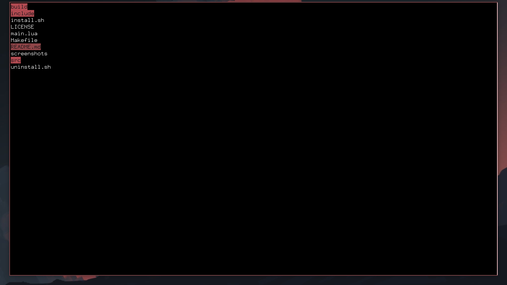

# mich
An item selector TUI applet made in lua.



## Installation
To install mich, first clone this repository with
```
git clone https://github.com/garipew/mich.git
cd mich
```

Then, run the install script
```
sudo ./install.sh
```

To uninstall, ~~dont bother~~ 
```
sudo ./uninstall.sh
```

## Usage
Pass the options as arguments
```
mich option1 option2 option3
```

For more on usage, try
```
mich -h
```  

## Notes
- mich is not a standalone application but a tool to integrate into your pipeline. (check our [examples](examples))

- All selected itens are written to stdout on <kbd>Enter</kbd>.

- If no item is selected, then the item under the cursor is written.

### Navigation
mich implements vim-**like** navigation

- <kbd>j</kbd> - Move cursor down
- <kbd>k</kbd> - Move cursor up
- <kbd>Shift</kbd>+<kbd>j</kbd> - Scroll down
- <kbd>Shift</kbd>+<kbd>k</kbd> - Scroll up
- <kbd>Tab</kbd> - Select item under the cursor
- <kbd>Enter</kbd> - Prints selected itens to stdout
